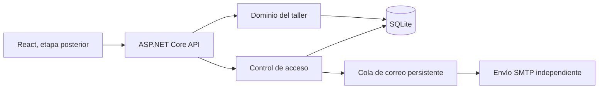

# TallerOS

Sistema de gestión para un solo taller de automóviles y motocicletas. La Práctica 1 entrega el Control de acceso completo y la estructura de estados de la orden de reparación. La API usa C# y ASP.NET Core 10, Entity Framework Core y SQLite. React se incorporará en una etapa posterior.

## Requisitos y ejecución desde un clon

1. Instala el SDK de .NET 10 y clona este repositorio. Ejecuta los comandos desde la raíz `TallerOs`.
2. Ejecuta `dotnet restore TallerOs.slnx` y `dotnet build TallerOs.slnx`.
3. En PowerShell, crea un Administrador inicial con un correo distinto del que usarás para probar el registro:

   ```powershell
   $env:ADMIN_EMAIL = Read-Host 'Correo del Administrador'
   $secure = Read-Host 'Contraseña del Administrador' -AsSecureString
   $env:ADMIN_PASSWORD = [System.Net.NetworkCredential]::new('', $secure).Password
   dotnet run --project src/TallerOs.Api --no-launch-profile -- bootstrap-admin
   Remove-Item Env:ADMIN_PASSWORD
   ```

   La contraseña debe tener al menos ocho caracteres, letras y números. Este comando solo crea el primer Administrador; si ya existe uno, no crea otro.

4. En la misma terminal, inicia la API:

   ```powershell
   $env:APP_BASE_URL = 'http://localhost:5000'
   dotnet run --project src/TallerOs.Api --no-launch-profile --urls http://localhost:5000
   ```

   Abre `http://localhost:5000/health`. Debe responder `{"status":"ok"}`. La base SQLite se crea en `data/talleros.db`, fuera del control de versiones. Al reiniciar la API conserva usuarios y correos. `DB_PATH` permite elegir otra ruta.

5. Abre **otra** terminal PowerShell en la raíz del repositorio para las peticiones. El correo se envía con el comando independiente `send-mail` descrito abajo.

## Variables de entorno

| Nombre | Para qué sirve |
| --- | --- |
| `DB_PATH` | Ruta opcional de la base SQLite; por defecto `data/talleros.db`. Usa la misma ruta en la API y en los comandos. |
| `APP_BASE_URL` | Dirección pública de la API usada en los enlaces de activación. |
| `ADMIN_EMAIL` | Correo del primer Administrador, usado solo por `bootstrap-admin`. |
| `ADMIN_PASSWORD` | Contraseña del primer Administrador, usada solo por `bootstrap-admin`. |
| `SMTP_HOST` | Servidor SMTP que entrega los correos. |
| `SMTP_PORT` | Puerto SMTP; por defecto 587. |
| `SMTP_USER` | Usuario de autenticación SMTP. |
| `SMTP_PASSWORD` | Contraseña de aplicación o credencial SMTP. |
| `SMTP_FROM` | Dirección remitente del correo. |

No coloques los valores en archivos versionados ni en commits. Para una cuenta Gmail personal, configura el servidor de Gmail y una contraseña de aplicación en tu entorno local; no uses la contraseña normal de la cuenta. La cuenta debe permitir enviar al correo que el evaluador elija.

### Envío de los correos pendientes

En la **segunda terminal**, define `SMTP_HOST`, `SMTP_PORT`, `SMTP_USER`, `SMTP_PASSWORD` y `SMTP_FROM` como variables de entorno con los datos de tu proveedor. Para Gmail personal con verificación en dos pasos y una [contraseña de aplicación](https://support.google.com/accounts/answer/185833), usa estos comandos de PowerShell. La dirección remitente debe ser la de esa misma cuenta:

```powershell
$env:SMTP_HOST = 'smtp.gmail.com'
$env:SMTP_PORT = '587'
$env:SMTP_USER = Read-Host 'Tu dirección de Gmail'
$env:SMTP_FROM = $env:SMTP_USER
$secure = Read-Host 'Contraseña de aplicación de Google' -AsSecureString
$env:SMTP_PASSWORD = [System.Net.NetworkCredential]::new('', $secure).Password.Replace(' ', '')
```

El puerto 587 usa STARTTLS. No pegues la contraseña en el chat ni la guardes en el repositorio. Define `DB_PATH` si cambiaste su ruta en la API. Luego ejecuta:

```powershell
dotnet run --project src/TallerOs.Api --no-launch-profile -- send-mail
```

Cuando termines la prueba, ejecuta `Remove-Item Env:SMTP_PASSWORD` en esa terminal.

El comando informa cuántos correos envió. Ejecutarlo otra vez debe informar cero si no hay nuevos pendientes. Si SMTP falla, el registro o la recuperación ya terminaron bien y el correo permanece pendiente; corrige la conexión y repite el comando. Para la demo, ejecútalo después de registro, reenvío, recuperación o restablecimiento forzado. La aplicación **no envía correo dentro de esas peticiones**.

## API y pasos para comprobar los criterios

Todas las peticiones JSON usan `Content-Type: application/json`. En PowerShell:

```powershell
$base = 'http://localhost:5000'
$email = Read-Host 'Correo propio para recibir activación'
$password = Read-Host 'Contraseña de prueba'
$body = @{ name = 'Usuario de prueba'; email = $email; password = $password } | ConvertTo-Json
Invoke-RestMethod "$base/api/access/register" -Method Post -ContentType 'application/json' -Body $body
```

Ejecuta `send-mail` y abre el enlace recibido. La ruta del enlace es `GET /api/access/activate?token=...`. Antes de abrirlo, `/api/access/login` debe rechazar la cuenta inactiva; abrirlo dos veces debe rechazar la segunda apertura.

### Rutas públicas

| Método y ruta | JSON o parámetro | Comprobación |
| --- | --- | --- |
| `POST /api/access/register` | `name`, `email`, `password` | RF-CA-01/02/14/15: correo único; hash con sal; contraseña mínima; nace inactiva y encola enlace. Repite el correo, usa una contraseña corta y un correo mal formado para ver rechazos controlados. |
| `GET /api/access/activate?token=...` | Token del correo | RF-CA-16: activa una sola vez; un enlace usado o vencido se rechaza. |
| `POST /api/access/resend-activation` | `email` | RF-CA-17: la respuesta es igual para correo existente o inexistente; el enlace anterior deja de servir. Ejecuta `send-mail` para recibir el nuevo. |
| `POST /api/access/login` | `email`, `password` | RF-CA-03/19: entrega `token`. Correo inexistente y contraseña errónea dan el mismo mensaje. Tras cinco errores consecutivos, la contraseña correcta también se rechaza durante 15 minutos. |
| `POST /api/access/forgot-password` | `email` | RF-CA-09/10: misma respuesta para correo existente o no. Encola un código de un solo uso que vence en 30 minutos. Ejecuta `send-mail`. |
| `POST /api/access/reset-password` | `code`, `newPassword` | RF-CA-11/12/14: usa el código recibido. Repetirlo falla; la contraseña antigua y las sesiones anteriores dejan de funcionar. |

Para iniciar sesión y guardar la credencial:

```powershell
$loginBody = @{ email = $email; password = $password } | ConvertTo-Json
$session = Invoke-RestMethod "$base/api/access/login" -Method Post -ContentType 'application/json' -Body $loginBody
$headers = @{ Authorization = "Bearer $($session.token)" }
Invoke-RestMethod "$base/api/access/me" -Headers $headers
```

### Rutas con sesión

| Método y ruta | JSON | Comprobación |
| --- | --- | --- |
| `GET /api/access/me` | — | RF-CA-07: devuelve usuario y rol; sin credencial válida devuelve 401. |
| `POST /api/access/logout` | `{}` | RF-CA-18: la misma credencial deja de servir tras el cierre. |
| `POST /api/access/change-password` | `currentPassword`, `newPassword` | RF-CA-22/12/14: la contraseña actual incorrecta se rechaza; al cambiarla caducan todas las sesiones anteriores. |

Envía la cabecera `Authorization: Bearer <token>` a todas estas rutas. Tras cambiar contraseña, inicia sesión otra vez para obtener una credencial nueva.

### Rutas de Administrador

Inicia sesión con el Administrador creado por `bootstrap-admin` y usa su token en la cabecera `Authorization`. Prueba **las mismas rutas con el token de un Estándar**: deben responder 403 incluso si construyes la petición manualmente.

| Método y ruta | Datos | Comprobación |
| --- | --- | --- |
| `GET /api/admin/users/` | — | RF-CA-04/05/06/21: lista ID, nombre, correo, rol y estado; no devuelve hashes ni tokens. |
| `PUT /api/admin/users/{id}/role` | JSON `{"role":"Administrator"}` o `{"role":"Standard"}` | RF-CA-08: solo el Administrador cambia roles. |
| `PUT /api/admin/users/{id}/enabled?enabled=false` | `{}` | RF-CA-20: desactiva al usuario; su sesión abierta deja de servir. Con `enabled=true` lo reactiva. Intentar desactivar el propio Administrador se rechaza. |
| `POST /api/admin/users/{id}/force-reset` | `{}` | RF-CA-13: invalida la contraseña y sesiones existentes; encola un código nuevo. Ejecuta `send-mail` para recibirlo. |

`AccessAuthorization.cs` declara en una sola tabla el rol exigido por **cada ruta**: pública, Estándar o Administrador. El middleware consulta esa tabla antes de ejecutar la operación. Una ruta de acceso nueva que no esté declarada se rechaza, de modo que no queda pública por accidente.

### Almacenamiento y cola

La base SQLite está en `data/talleros.db`. Comprueba que `Users.PasswordHash` no contiene la contraseña escrita y que dos usuarios con la misma contraseña tienen hashes distintos. `ActivationTokens`, `RecoveryCodes` y `Sessions` almacenan **hashes de los secretos**, no los valores entregados al usuario. `EmailOutbox` muestra los correos `Pending` y `Sent`; tras enviar, ejecutar de nuevo `send-mail` no vuelve a entregar los enviados. Puedes abrir la base con cualquier visor SQLite.

Para simular SMTP caído, registra un usuario sin ejecutar `send-mail` o configura temporalmente un servidor SMTP inaccesible antes de invocar el comando. El registro responde correctamente y el correo permanece `Pending`. Reinicia la API y vuelve a consultar los usuarios para comprobar RD-09.

## Máquina de estados del negocio



`WorkOrder` es la entidad central del taller. `Customer`, `Vehicle`, `WorkOrder` y `Diagnosis` están relacionados en el modelo persistente. Los cinco estados y las transiciones se declaran en `src/TallerOs.Api/Workshop/WorkOrder.cs`. Consulta [la tabla de transiciones](docs/maquina-de-estados.md). `Delivered` es terminal y `Received → InRepair` está prohibida explícitamente. Esta práctica no exige todavía las pruebas de la máquina.

## Flujo Git de la práctica

Cada funcionalidad se desarrolla en una rama `feature/...`, con commits pequeños cuyo asunto está en imperativo y cita el requisito. Cada PR describe **Qué cambia, Por qué, Cómo probarlo y Qué NO incluye**. Los cuatro grupos mínimos son registro/activación, sesión, recuperación de contraseña y administración de usuarios. Tras fusionarlos a `main` y verificar todos los criterios:

```powershell
git switch main
git pull --ff-only
git tag practica-1
git push origin practica-1
```

En Moodle se entrega la URL del repositorio y el nombre `practica-1`. El evaluador usa ese punto etiquetado.
